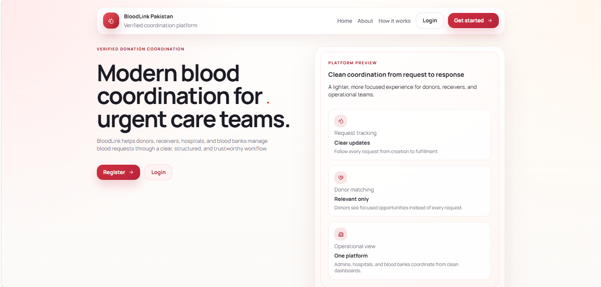

# BloodLink Pakistan

A production-style blood donation and blood bank coordination platform for Pakistan that connects donors, receivers, hospitals, blood banks, institution donors, and admins through verified request capture, automatic matching, messaging, and status tracking.

## Built with

<p align="left">
  
  
  
  
</p>

<p align="left">
  
  
  
  
</p>

<p align="left">
  
  
  
</p>

- Frontend: React + Vite
- Backend: FastAPI
- Database: PostgreSQL
- ORM and migrations: SQLAlchemy + Alembic
- Cache and queue support: Redis
- Object storage foundation: MinIO
- Containerization: Docker + Docker Compose




## Problem statement
Blood donation coordination in Pakistan is often handled through scattered social posts, informal donor lists, and unverifiable requests. That creates fake appeal risk, poor privacy practices, manual back-and-forth, and weak request tracking once a donor is found.

## Solution
BloodLink focuses on a realistic MVP:
- Donors register and create city-based donor profiles.
- Receivers create blood requests with hospital details and upload a hospital slip in the same flow.
- Matching happens automatically using city, blood-group compatibility, donor availability, and donation recency rules.
- Donors can stay private or mark themselves publicly available for compatible receiver outreach in-app.
- Receivers can also discover blood banks and institution donors in the same city.
- Institution donors register through a separate verification flow and only become publicly visible after admin approval.
- Chat and notifications keep receiver-to-donor and receiver-to-institution coordination inside the platform.
- Admins act as the trust and moderation layer, with analytics, audit logs, reports, and system-wide visibility.

## MVP features
- Donor registration and login
- Receiver registration and login
- Institution donor self-registration and login
- Institution approval flow with pending, approved, rejected, and suspended states
- Admin login through seed data
- Donor profile creation, availability management, and public visibility toggle
- Receiver profile foundation and blood request creation with required hospital slip upload
- Automatic donor matching by blood-group compatibility, city, availability, and donation recency
- Donor accept or reject flow for assigned matches
- Receiver views for matched donors, public donors, blood banks, and institutions in the request city
- Blood bank inventory management with unit creation, summary metrics, and city-request visibility
- Hospital staff workspace for hospital-originated request intake
- Institution donor workspace with status-based access control and admin approval gating
- Simple in-app messaging between receivers and matched donors, public donors, blood banks, and institutions
- FastAPI WebSocket support for real-time chat in active conversation views
- In-app notifications
- Basic admin dashboard, analytics, reports, and audit trail
- Pakistan city seed data with room to extend later
- Search and filter flows for donors, requests, hospital demand, and blood bank inventory
- Modern responsive healthcare UI with reusable cards, badges, alerts, modals, and empty states
- API versioning at `/api/v1`
- Redis, MinIO, worker, and scheduler Docker services
- Docker Compose setup for frontend, backend, and PostgreSQL
- PostgreSQL backup and restore notes
- Responsive UI for mobile and desktop

## Tech stack
- Frontend: React + Vite + Lucide React + custom modern CSS design system
- Backend: FastAPI
- Database: PostgreSQL
- Cache / queue broker: Redis
- Object storage foundation: MinIO
- ORM and migrations: SQLAlchemy + Alembic
- Containerization: Docker + Docker Compose

## Project structure
```text
bloodlink-pakistan/
|- frontend/
|  |- src/
|  |- public/
|  |- package.json
|  |- Dockerfile
|  `- .env.example
|- backend/
|  |- app/
|  |  |- api/
|  |  |- core/
|  |  |- models/
|  |  |- routes/
|  |  |- schemas/
|  |  |- services/
|  |  |- tests/
|  |  |- worker.py
|  |  `- scheduler.py
|  |- alembic/
|  |- requirements.txt
|  |- Dockerfile
|  `- .env.example
|- docs/
|- docker-compose.yml
|- .env.example
|- .gitignore
|- AGENTS.md
`- README.md
```

## User roles
- Donor: manages only their own donor profile, sees only relevant requests or matches, can reply in valid chats, and can optionally appear as a public donor in their city.
- Receiver / Patient Attendant: manages only their own requests, uploads hospital slips, tracks matches, discovers public donors, blood banks, and institutions, and opens role-safe chats.
- Admin: reviews users, donors, receivers, requests, reports, matches, and audit logs across the whole platform.
- Hospital Staff: works only inside the assigned hospital workspace and creates hospital-originated requests.
- Blood Bank Staff: works only inside the assigned blood bank scope, manages inventory, and monitors city demand.
- Institution Donor: registers through a separate verification flow and only gets full institution features after admin approval.

## Permissions
- Donor can only manage their own donor profile.
- Donor can only view requests relevant to the donor experience and respond to their own matches.
- Donor cannot browse all requests or access admin areas.
- Donor can only accept or reject matches assigned to them.
- Receiver can only manage their own blood requests.
- Receiver can only view matches related to their own requests and only contact valid in-scope donors or organizations.
- Hospital staff can only operate within their assigned hospital.
- Blood bank staff can only operate within their assigned blood bank.
- Pending, rejected, and suspended institutions cannot access full institution features, public visibility, or receiver messaging.
- Approved institution donors can manage their own institution profile and message threads.
- Admin can manage all users, donors, requests, matches, reports, and audit logs.
- Admin can approve, reject, or suspend institution accounts from the protected admin workspace.

## System workflow
1. A donor or receiver creates an account, or an institution submits a separate verification registration.
2. A receiver or hospital staff member creates a blood request and uploads the supporting slip.
3. BloodLink automatically looks for compatible donors in the same city.
4. Candidate matches are created and donors receive notifications.
5. Admin reviews institution registrations and approves only legitimate organizations for public visibility.
6. Receivers can discover public donors, blood banks, and approved institutions in the same city.
7. Donors accept or reject assigned matches.
8. Receivers track confirmed donor counts, message valid contacts, and mark the request fulfilled.
9. Admins monitor users, reports, inventory visibility, and audit history.

## Database overview
Core tables in the MVP include:
- `users`
- `donor_profiles`
- `receiver_profiles`
- `blood_requests`
- `request_documents`
- `donation_matches`
- `blood_banks`
- `blood_units`
- `institutions`
- `chats`
- `chat_messages`
- `notifications`
- `reports`
- `audit_logs`
- `cities`

## API documentation
- FastAPI Swagger docs: [http://localhost:8000/docs](http://localhost:8000/docs)
- Health check: `GET /health`

## Environment variables
Copy the root template and then create service-local `.env` files if needed.

Root `.env.example`:
```env
DATABASE_URL=postgresql+psycopg://blood_user:blood_password@db:5432/blood_app
SECRET_KEY=change_this_secret
ACCESS_TOKEN_EXPIRE_MINUTES=60
BACKEND_CORS_ORIGINS=["http://localhost:5173"]
VITE_API_BASE_URL=http://localhost:8000
UPLOAD_DIR=/app/uploads
REDIS_URL=redis://redis:6379/0
MINIO_ENDPOINT=http://minio:9000
MINIO_ACCESS_KEY=minioadmin
MINIO_SECRET_KEY=minioadmin
MINIO_BUCKET_NAME=bloodlink-private
```

Backend `.env.example` and frontend `.env.example` mirror the service-specific values required for local work.

## Local setup with Docker
1. Copy `.env.example` to `.env`.
2. Run:

```bash
docker compose up --build
```

Expected local URLs:
- Frontend: [http://localhost:5173](http://localhost:5173)
- Backend: [http://localhost:8000](http://localhost:8000)
- FastAPI docs: [http://localhost:8000/docs](http://localhost:8000/docs)
- MinIO API: [http://localhost:9000](http://localhost:9000)
- MinIO Console: [http://localhost:9001](http://localhost:9001)

## Local setup without Docker
### Frontend
```bash
cd frontend
npm install
npm run dev
```

### Backend
```bash
cd backend
python -m venv venv
pip install -r requirements.txt
alembic upgrade head
python -m app.seed
uvicorn app.main:app --reload
```

### Database
Use either:
- Local PostgreSQL with a connection string matching `DATABASE_URL`
- The Docker PostgreSQL service from `docker compose up db -d`

## Database migrations
```bash
cd backend
alembic revision --autogenerate -m "initial tables"
alembic upgrade head
```

## Seed data
Included sample data:
- 1 admin user
- 3 donor users with different blood groups
- 2 receiver users
- 1 institution donor user
- 3 sample blood requests
- 2 sample donation matches
- 1 sample hospital
- 1 sample blood bank
- 1 approved sample institution profile
- Major Pakistan city seed data
- Sample notifications and chat history

Default test admin:
- Email: `admin@bloodlink.pk`
- Password: `Admin12345`

Other useful seeded accounts:
- Hospital admin: `hospital.admin@bloodlink.pk` / `Hospital12345`
- Blood bank admin: `bloodbank.admin@bloodlink.pk` / `BloodBank12345`
- Institution donor: `institution@bloodlink.pk` / `Institution12345`

Institution approval note:
- New institution registrations start as `pending_approval`
- Pending institutions are redirected to a verification progress screen
- Only `approved` institutions appear in receiver listings and can use institution messaging
- `rejected` institutions can correct details and resubmit for review
- `suspended` institutions lose institution access until restored by admin

## Backup and restore
Backup:
```bash
docker exec -t bloodlink-postgres pg_dump -U blood_user -d blood_app > backup.sql
```

Restore:
```bash
cat backup.sql | docker exec -i bloodlink-postgres psql -U blood_user -d blood_app
```

## Validation and security notes
- Valid Pakistani mobile number format is enforced.
- Blood group values are limited to `A+`, `A-`, `B+`, `B-`, `AB+`, `AB-`, `O+`, and `O-`.
- Units required must be greater than zero.
- Donor age is constrained to a reasonable donation range.
- Last donation date cannot be in the future.
- Required-by date and time cannot be empty or in the past.
- Passwords are hashed with bcrypt through Passlib.
- JWT-based authentication protects private routes.
- Uploaded files are stored on disk, not in PostgreSQL.
- Uploaded hospital slips are served only through authorized backend routes.
- Donor phone numbers are not exposed in receiver-facing match listings.
- `.env`, uploads, and generated local artifacts are ignored by Git.

## Testing
Basic backend tests cover:
- Health route
- Auth register and login flow
- Institution registration and approval-state access control
- Donor profile creation
- Blood request creation and auto-matching
- Matching service logic
- Public donor discovery
- Chat creation
- WebSocket chat delivery
- Admin approval route compatibility
- Hospital dashboard route
- Blood bank inventory summary route

Run:
```bash
cd backend
pytest
```

Manual frontend verification covers:
- Public landing, about, and how-it-works pages
- Donor, receiver, admin, hospital, blood bank, and institution dashboards
- Receiver request creation with hospital slip upload
- Public donor, blood bank, institution, and chat flows
- Responsive layout behavior across mobile and desktop widths
- Search and filter interactions for donor/request/inventory lists

## Deployment notes
Suggested future-friendly hosting options:
- Frontend: Vercel or Netlify
- Backend: Render, Railway, or a VPS
- Database: Supabase, Neon, Railway, or Docker PostgreSQL on a VPS
- File storage later: Supabase Storage, AWS S3, Cloudinary, or MinIO

This MVP intentionally avoids paid integrations and complex production orchestration. Docker Compose is used for realistic local development, not Kubernetes or microservices.

## Medical and legal disclaimer
This application is not a replacement for hospitals, licensed blood banks, medical screening, or transfusion approval. Final blood testing, crossmatching, and transfusion decisions must be handled by authorized hospitals or blood banks.

## Limitations
- No real SMS or WhatsApp notifications in MVP
- No NADRA verification
- No medical approval workflow
- Donor, receiver, and request moderation are auto-approved in the MVP instead of manually reviewed
- No full production blood bank inventory lifecycle yet beyond the current foundation
- Real-time chat does not yet include typing indicators, read receipts, or offline sync state
- No mobile app yet
- No real hospital system integration yet beyond the current hospital workspace foundation

## Future updates / roadmap
### Version 1.1: Better verification
- Phone OTP
- CNIC upload
- Admin approval for donor profiles
- Admin approval for receiver requests
- Admin approval for blood requests
- Admin document review enhancements
- Donor health questionnaire
- Fake request reporting improvements
- Better audit logs

### Version 1.2: Better notifications
- SMS alerts
- WhatsApp alerts
- Email alerts
- Emergency broadcast
- Notification preferences

### Version 2: Hospital dashboard
- Hospital account
- Hospital-created blood requests
- Full hospital verification workflow
- Confirm patient need
- Confirm donor arrival
- Mark donation completed
- Hospital verification badge

### Version 3: Blood bank inventory
- Blood unit inventory
- Blood group stock
- Expiry tracking
- Testing status
- Blood component tracking
- Low-stock alerts
- Advanced blood bank inventory lifecycle

### Version 4: QR and traceability
- QR code for blood units
- Donation record
- Blood unit movement history
- Donor-to-blood-bank traceability
- Blood bank-to-hospital traceability

### Version 5: Mobile app
- React Native + Expo
- Same FastAPI backend
- Same PostgreSQL database
- Push notifications
- Camera or gallery upload for documents
- GPS-based nearby requests

### Version 6: Advanced intelligence
- AI fake request detection
- Donor reliability score
- Demand prediction by city
- Rare blood group registry
- Emergency heatmap
- Advanced analytics

## License
MIT. See [LICENSE](LICENSE).
