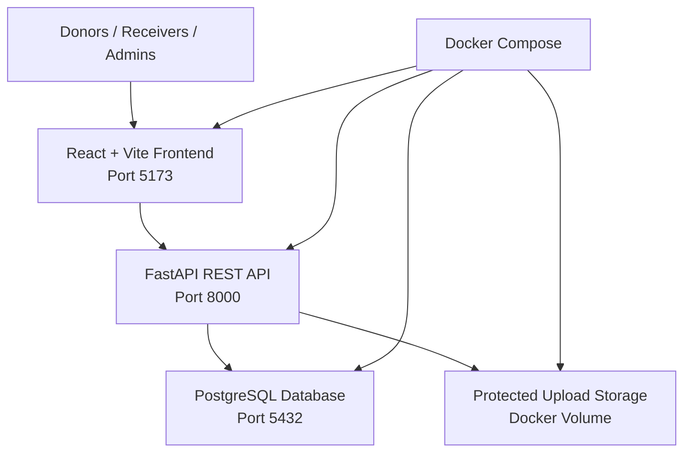

# BloodLink Pakistan


A verified blood donation coordination platform for Pakistan that connects donors, receivers, and admins through blood requests, donor matching, request verification, and status tracking.


## Problem statement
Blood donation coordination in Pakistan is often handled through scattered social posts, informal donor lists, and unverifiable requests. That creates fake appeal risk, poor privacy practices, manual back-and-forth, and weak request tracking once a donor is found.

## Solution
BloodLink focuses on a realistic MVP:
- Donors register and create city-based donor profiles.
- Receivers create blood requests with hospital details and upload a hospital slip.
- Admins verify donor profiles and blood requests before coordination starts.
- Matching stays intentionally simple: blood group, city, donor availability, approval status, and donation recency.
- Donors accept or reject assigned matches.
- Receivers track status and confirmed donor counts.
- Admins monitor reports, notifications, and audit logs.

## MVP features
- Donor registration and login
- Receiver registration and login
- Admin login through seed data
- Donor profile creation and availability management
- Blood request creation and tracking
- Hospital slip upload with file type and size validation
- Admin donor approval and request approval workflows
- Simple donor matching by blood group and city
- Donor accept or reject flow for assigned matches
- In-app notifications
- Basic admin dashboard and analytics
- Docker Compose setup for frontend, backend, and PostgreSQL
- PostgreSQL backup and restore notes
- Responsive UI for mobile and desktop

## Tech stack
- Frontend: React + Vite
- Backend: FastAPI
- Database: PostgreSQL
- ORM and migrations: SQLAlchemy + Alembic
- Containerization: Docker + Docker Compose

## Architecture


## Project structure
```text
bloodlink-pakistan/
├── frontend/
│   ├── src/
│   ├── public/
│   ├── package.json
│   ├── Dockerfile
│   └── .env.example
├── backend/
│   ├── app/
│   │   ├── main.py
│   │   ├── core/
│   │   ├── models/
│   │   ├── schemas/
│   │   ├── routes/
│   │   ├── services/
│   │   └── utils/
│   ├── alembic/
│   ├── requirements.txt
│   ├── Dockerfile
│   └── .env.example
├── docker-compose.yml
├── .env.example
├── .gitignore
├── AGENTS.md
└── README.md
```

## User roles
- Donor: manages only their own donor profile, sees matching approved requests, responds to assigned matches, and reads their own notifications.
- Receiver / Patient Attendant: manages only their own requests, uploads hospital slips, tracks match progress, marks requests fulfilled, and can report suspicious donors tied to their own requests.
- Admin: reviews users, donors, requests, reports, matches, and audit logs across the whole platform.

## Permissions
- Donor can only manage their own donor profile.
- Donor can only view approved or matched requests relevant to the donor experience.
- Donor can only accept or reject matches assigned to them.
- Receiver can only manage their own blood requests.
- Receiver can only view matches related to their own requests.
- Admin can manage all users, donors, requests, matches, reports, and audit logs.

## API documentation
- FastAPI Swagger docs: [http://localhost:8000/docs](http://localhost:8000/docs)
- Health check: `GET /health`

## Environment variables
Copy the root template and then create service-local `.env` files if needed.

Root `.env.example`:
```env
DATABASE_URL=postgresql+psycopg://blood_user:blood_password@db:5432/blood_app
SECRET_KEY=change_this_secret
ACCESS_TOKEN_EXPIRE_MINUTES=60
BACKEND_CORS_ORIGINS=http://localhost:5173
VITE_API_BASE_URL=http://localhost:8000
UPLOAD_DIR=/app/uploads
```

Backend `.env.example` and frontend `.env.example` mirror the service-specific values required for local work.

## Local setup with Docker
1. Copy `.env.example` to `.env`.
2. Run:

```bash
docker compose up --build
```

Expected local URLs:
- Frontend: [http://localhost:5173](http://localhost:5173)
- Backend: [http://localhost:8000](http://localhost:8000)
- FastAPI docs: [http://localhost:8000/docs](http://localhost:8000/docs)

## Local setup without Docker
### Frontend
```bash
cd frontend
npm install
npm run dev
```

### Backend
```bash
cd backend
python -m venv venv
pip install -r requirements.txt
alembic upgrade head
python -m app.seed
uvicorn app.main:app --reload
```

### Database
Use either:
- Local PostgreSQL with a connection string matching `DATABASE_URL`
- The Docker PostgreSQL service from `docker compose up db -d`

## Database migrations
```bash
cd backend
alembic revision --autogenerate -m "initial tables"
alembic upgrade head
```

## Seed data
Included sample data:
- 1 admin user
- 3 donor users with different blood groups
- 2 receiver users
- 3 sample blood requests
- 2 sample donation matches
- Sample notifications

Default test admin:
- Email: `admin@bloodlink.pk`
- Password: `Admin12345`

## Backup and restore
Backup:
```bash
docker exec -t bloodlink-postgres pg_dump -U blood_user -d blood_app > backup.sql
```

Restore:
```bash
cat backup.sql | docker exec -i bloodlink-postgres psql -U blood_user -d blood_app
```

## Validation and security notes
- Valid Pakistani mobile number format is enforced.
- Blood group values are limited to `A+`, `A-`, `B+`, `B-`, `AB+`, `AB-`, `O+`, and `O-`.
- Units required must be greater than zero.
- Donor age is constrained to a reasonable donation range.
- Last donation date cannot be in the future.
- Required-by date and time cannot be empty or in the past.
- Passwords are hashed with bcrypt through Passlib.
- JWT-based authentication protects private routes.
- Uploaded files are stored on disk, not in PostgreSQL.
- Uploaded hospital slips are served only through authorized backend routes.
- Donor phone numbers are not exposed in receiver-facing match listings.
- `.env`, uploads, and generated local artifacts are ignored by Git.

## Testing
Basic backend tests cover:
- Health route
- Auth register and login flow
- Donor profile creation
- Blood request creation
- Matching service logic
- Admin approval route

Run:
```bash
cd backend
pytest
```

## Deployment notes
Suggested future-friendly hosting options:
- Frontend: Vercel or Netlify
- Backend: Render, Railway, or a VPS
- Database: Supabase, Neon, Railway, or Docker PostgreSQL on a VPS
- File storage later: Supabase Storage, AWS S3, Cloudinary, or MinIO

This MVP intentionally avoids paid integrations and complex production orchestration. Docker Compose is used for realistic local development, not Kubernetes or microservices.

## Medical and legal disclaimer
This application is not a replacement for hospitals, licensed blood banks, medical screening, or transfusion approval. Final blood testing, crossmatching, and transfusion decisions must be handled by authorized hospitals or blood banks.

## Limitations
- No real SMS or WhatsApp notifications in MVP
- No NADRA verification
- No medical approval workflow
- No blood bank inventory management yet
- No mobile app yet
- No real hospital integration yet

## Future updates / roadmap
### Version 1.1: Better verification
- Phone OTP
- CNIC upload
- Admin document review enhancements
- Donor health questionnaire
- Fake request reporting improvements
- Better audit logs

### Version 1.2: Better notifications
- SMS alerts
- WhatsApp alerts
- Email alerts
- Emergency broadcast
- Notification preferences

### Version 2: Hospital dashboard
- Hospital account
- Hospital-created blood requests
- Confirm patient need
- Confirm donor arrival
- Mark donation completed
- Hospital verification badge

### Version 3: Blood bank inventory
- Blood unit inventory
- Blood group stock
- Expiry tracking
- Testing status
- Blood component tracking
- Low-stock alerts

### Version 4: QR and traceability
- QR code for blood units
- Donation record
- Blood unit movement history
- Donor-to-blood-bank traceability
- Blood bank-to-hospital traceability

### Version 5: Mobile app
- React Native + Expo
- Same FastAPI backend
- Same PostgreSQL database
- Push notifications
- Camera or gallery upload for documents
- GPS-based nearby requests

### Version 6: Advanced intelligence
- AI fake request detection
- Donor reliability score
- Demand prediction by city
- Rare blood group registry
- Emergency heatmap

## License
MIT. See [LICENSE](LICENSE).
